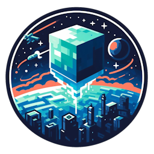

<h1 align="center">Space Client</h1>

[
]()

[
]()

    

---
### **<ins>
Condiciones de uso:
**
- Para usar el código, debe hacer una bifurcación de proyecto.
- Para usar el código, su código debe ser público todo el tiempo.
- Para usar el código, se debe mantener cualquier mención original de la licencia.
- Para usar el código, debe mantener la licencia original.
---

### **<ins>
Funciones del Launcher:
**

- ✅ Actualización automática a través de GitHub.

- 🔴 Opción para poner el Launcher en mantenimiento.

- 🔒 Autenticación de Microsoft.

- ⛏️ Admite todas las versiones de Minecraft 1.0> Último.

- 📦 Admite Moddées Forge, Neoforge, Legacyfabric, Fabricc y Quilt

- 📰 Línea de noticias integrada de forma nativa en el Launcher.

- ⚙️ Gestión intuitiva de parámetros, incluido un panel de configuración de Java.

- 🟢 Complete el estado del servidor.

    - operativo o fuera de línea.
    
    - desnudos de jugadores conectados.

- ☕ Instalación automática de Java.

    - Si ha instalado una versión incompatible de Java, instalaremos la adecuada para usted.
    
    - No necesita tener Java instalado para ejecutar el Launcher.

Esta no es una lista exhaustiva.¡Instale el Launcher para ver todo lo que pueda hacer!

¿Te gusta el proyecto?¡Deja una estrella ⭐ en el repositorio!

---

### **<ins>
Descargas:
**

Puede descargar el Launcher desde el [Releases GitHub](../../../releases).

Plataformas compatibles :

- Windows 
- Linux
- MacOS

Si se descarga de los lanzamientos, seleccione el programa de instalación para su sistema.
 Plataforma | Archivos |
| -------- | ---- |
| Windows x64 | `Space-Client-win-x64.exe` |
| macOS x64 | `Space-Client-mac-x64.dmg` |
| macOS arm64 | `Space-Client-mac-arm64.dmg` |
| Linux x64 | `Space-Client-linux-x86_64.AppImage` |

 

Si le gusta este proyecto y desea ayudar a desarrollarlo, puede darnos una donación sobre [Paypal](https://www.paypal.me/anthonnysan03).

Si tiene alguna pregunta, un problema o sugerencias no dudan en unirse a nuestro discord:

 

[][discord]
 
 

[
]() *Readme traducido por [@xToNySaNx](https://github.com/xtonysanx)*  

---

[discord]: https://discord.gg/ehTebhcu5V 'Discord'
